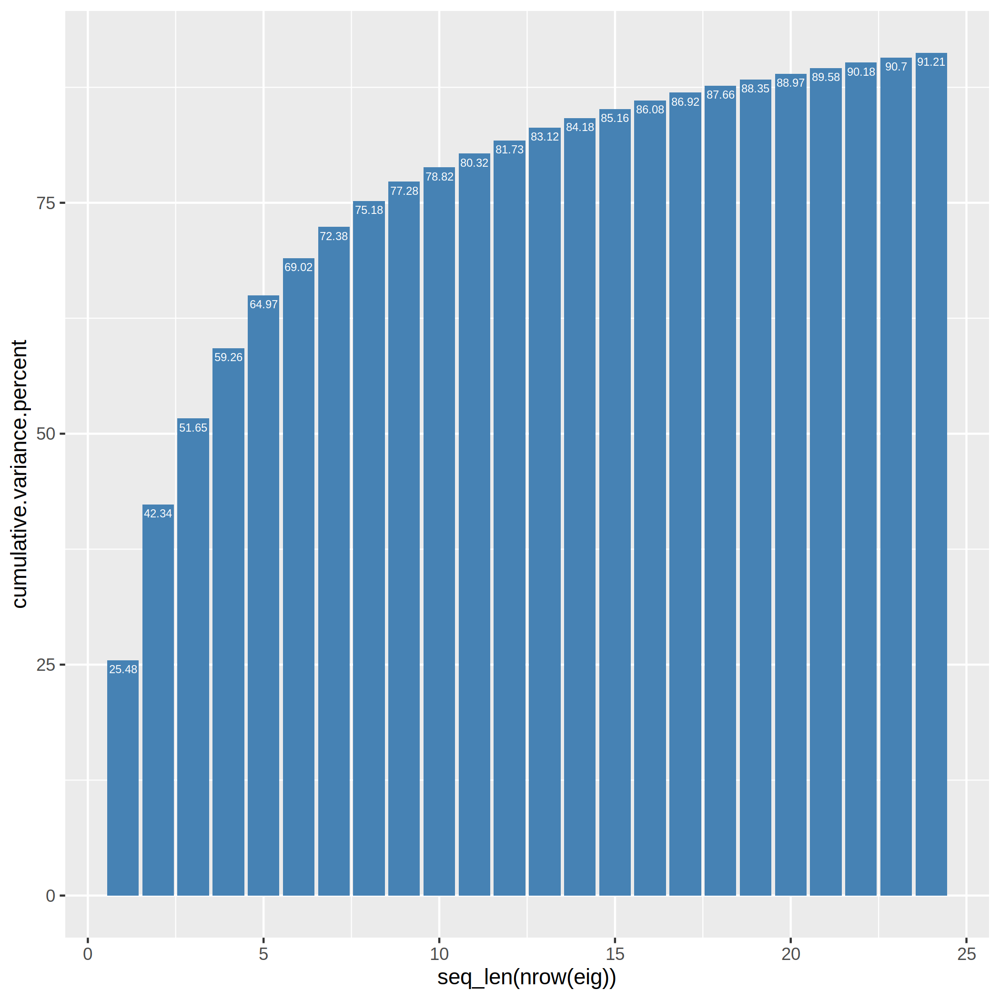
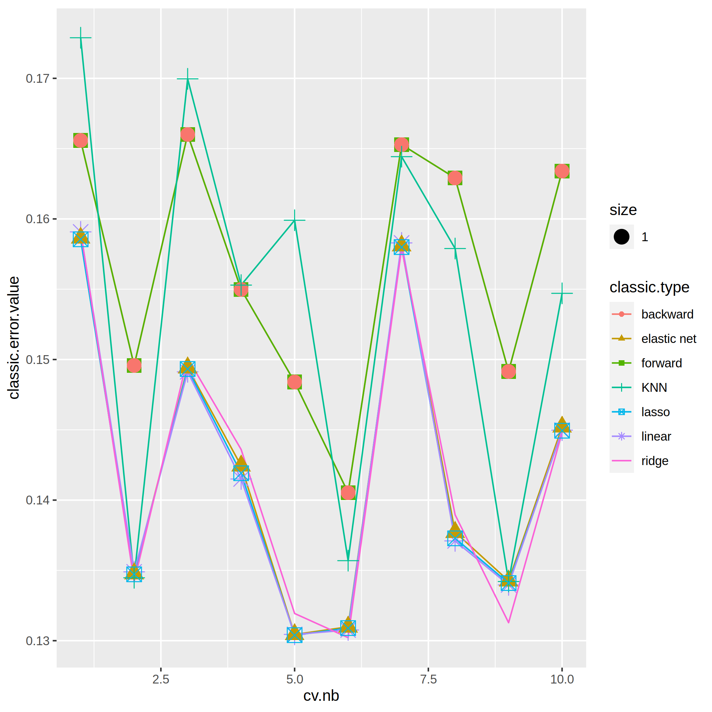
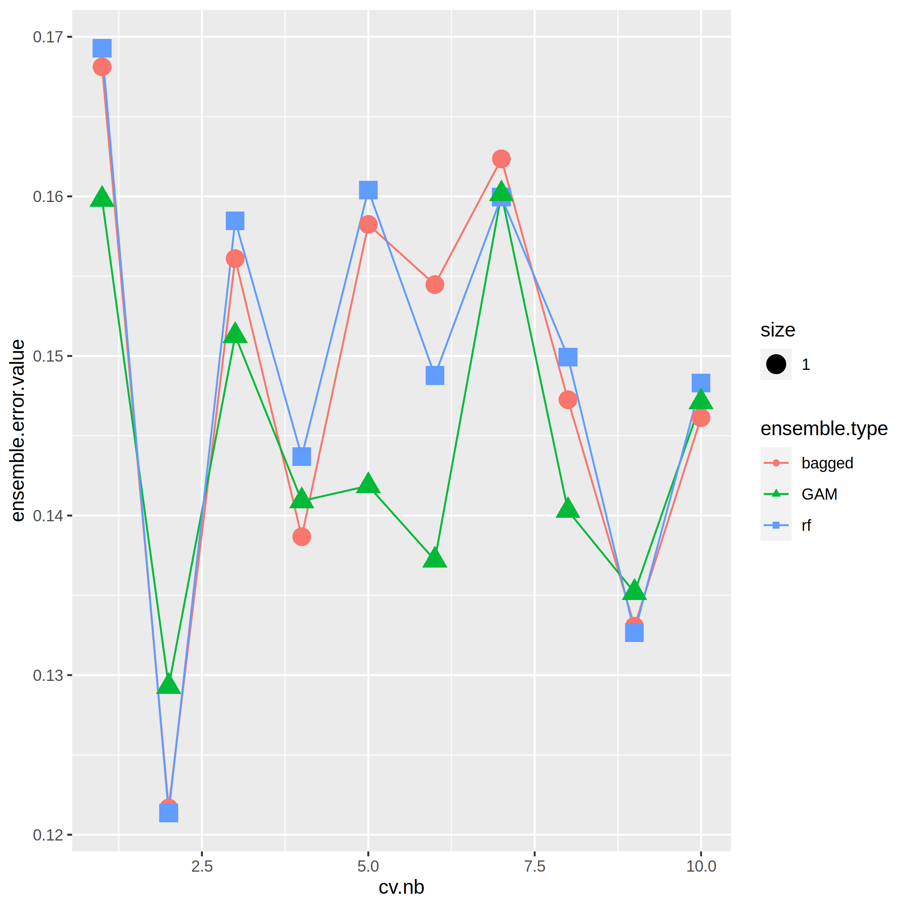
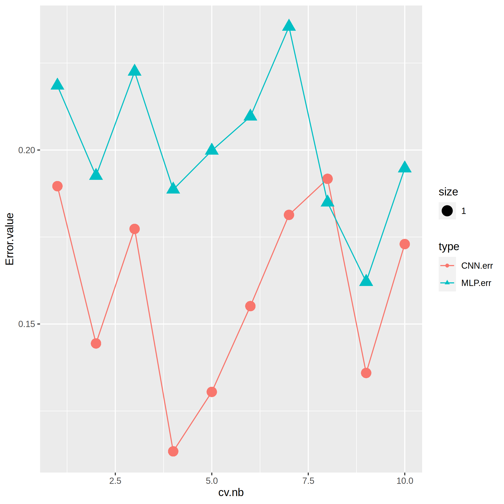
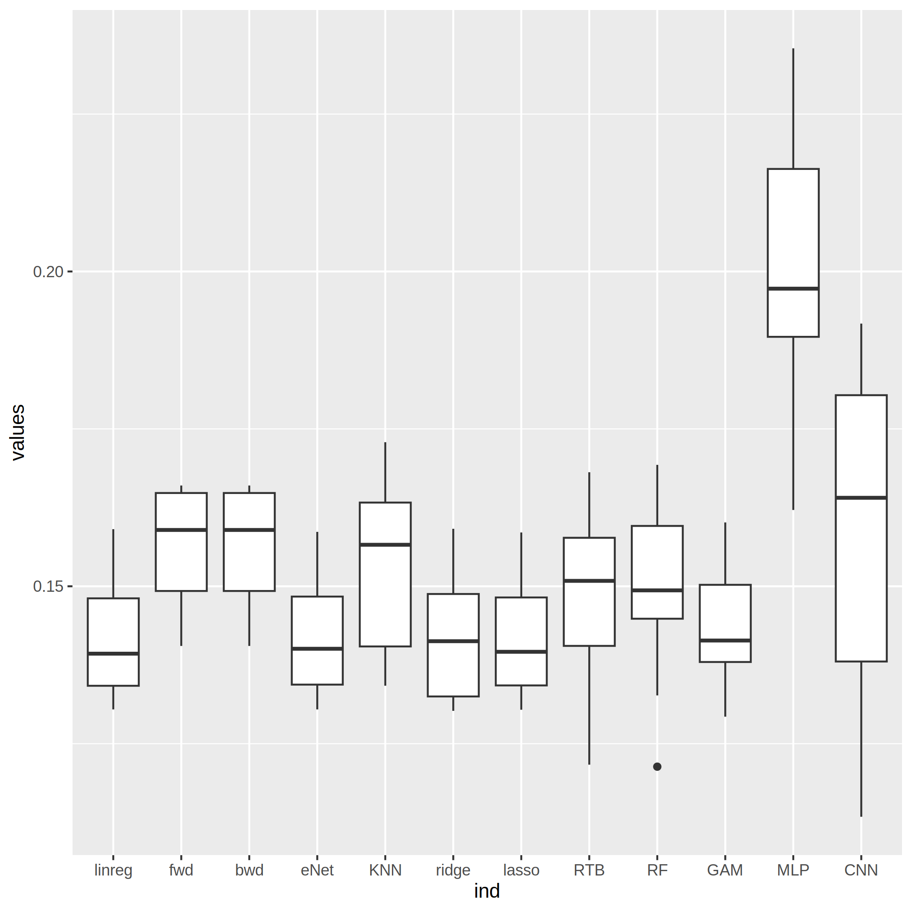

# Dataset Communities

## 1. Data exploration

The dataset contains 1000 observations, with 127 predictors and a single response variable, which is ViolentCrimePerPop. Descriptors are both continuous and categorical. Additionally, some records and columns have a significant amount of missing data.

## 2. Data pre-processing

First of all, we need to have an approach to missing data.
Except for the county and community columns, we observe that 22 columns have missing data in 833 records, comprising more than 80% of the entire dataset. Additionally, if a record has missing data in any of these 22 columns, it has missing data in all of them. Therefore, it is reasonable to remove all of these 22 columns from the dataset, leaving us with 105 columns. This is still a large number of predictors compared to the 1000 records.

We also observe that the county and community columns have missing data in 591 and 593 records, respectively. However, we observe that these two columns are categorical, and every tuple made of these two columns in every row is unique. Therefore, we conclude that these two columns will not be useful while training the model. It is reasonable to drop these two columns from the dataset as well.

Now, we have 103 descriptors left in the dataset with no missing data. This is still a large number of descriptors for only 1000 records. In order to reduce the number of predictors, we use **Principal Component Analysis** (PCA) to reduce the dimensionality of the data by retaining only those features that contain most of the variance and ignoring those that contain almost zero variance.

The equation get_eig() allows us to see what percentage of variance is explained by the components used. for example, in the figure below, the components of the first 22 dimensions explain 90% of the variance. In the following model training example (Part 3), we select the dimensions of the features according to the type of data that each model is good at handling.

## 3. Model training

As opposed to 1/3 of the data as the test set and 2/3 of the data as the training set, we use **k-fold cross-validation** to ensure the optimality of the training models. All models below are based on the k-fold cross-validation method.

### 3.1 Linear regression and its variance

Because the output is quantitative, the reasonable choice is to use regression methods. We start by applying linear regression methods and its variances including forward stepwise, backward stepwise, lasso, ridge, elastic net and fully linear regression.

We trained the models as follows:

We can see that several linear models fit better, while other models such as forward stepwise, backward stepwise and KNN perform worse.

So among these models, we can initially rule out KNN forward stepwise and backward stepwise first.

### 3.2 GAM, Bagging, and Random Forest

Here we compare and analyse the Generalized Additive Model (GAM), Bagging and Consequential Forest Model.\
\

We used the rpart package here to build the regression tree, optimally prune the tree and represent the resulting pruned tree. And to find an optimal value $\alpha$, we add an internal cross-validation.

We get the following results:

We can see that in all of these 3 models, GAM is the one that performs the best.

### 3.5 Neural networks

We use Tensorflow as well as the Keras library to train the model.

#### 3.5.1 Multi-Layer Perceptrons + CNN

The first step is to create a sequential model of the keras, a linear stack of multiple network layers. Then we definied the model with 1 input layer[128 neurons], 1 hidden layer[128 neurons] with dropout rate 0.8 and 1 output layer[5]. And we compiled the defined model with metric being root_mean_squared_error and optimiser as adam.

We also apply the convolutional neural networks model to the dataset.

Finally, we evaluate the model on a cross-validation dataset.

#### 4. Model selection

Surprisingly, linear regression methods and GAM perform really well for this dataset:

Comparing the various performances, we finally chose the lasso linear regression model using 22 principal components as training parameters.
