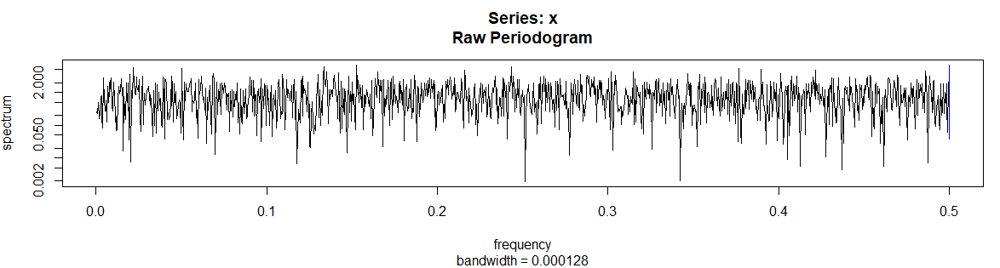

# Introduction

The aim of this second project is to apply the ML methods seen during SY19 courses on three real datasets: `Phoneme`, `Robotics` and `Communities`.

# Part I - `Phoneme` Dataset

The dataset was extracted from the *TIMIT database (TIMIT Acoustic-Phonetic Continuous Speech Corpus, NTIS, US Dept of Commerce)*. It contains the log-periodograms of 4509 speech frames of 32 ms duration, classified in five phonemes for classification: *"aa", "ao", "dcl", "iy" and "sh"*. From the 4509 samples, we have 2250 for training.

## 1. Data analysis

This part corresponds to the `Phoneme` classification. The dataset contains 2250 observations with 256 predictors and a single response variable. We observe that the classification is in **5 classes** and all the predictors are quantitative.

The spectrum is obtained by taking the discrete Fourier transform of a signal and using the frequency as the horizontal axis and the amplitude as the vertical axis. We use the R command `spectrum` to calculate the `periodogram` and to automatically plot it versus frequency:

```{r, echo=FALSE, out.width="60%", fig.cap="Periodogram of spectrum N.31", fig.align = 'center'}

```

## 2. Data pre-processing

Here we use the **Principal Component Analysis** (PCA) in order to reduce the number of predictors. We reduce the dimensionality of the data by retaining only those features that contain most of the variance and ignoring those that contain almost zero variance.

Realization: With the `prcomp` and `fviz_eig` functions from the library `factoextra`, we can plot the percentage of explained variances against the number of dimensions as follow in figure 2:

```{r, echo=FALSE, out.width="60%", fig.cap="PCA explained variance proportion for the first dimensions", fig.align = 'center'}

```

The equation from `get_eig` allows us to see what percentage of the variance is explained by the components used. for example, the *components of the first 39 dimensions explain 90% of the variance* (see figure 3). In the following model exploration (Subpart 3), we select the dimensions of the features according to the type of data that each model is the best at handling.

```{r, echo=FALSE, out.width="50%", fig.cap="PCA explained variance proportion of PC 36 to 40", fig.align = 'center'}

```

## 3. Model training

Instead of a simple split as 1/3 of the data for the test set and 2/3 of the data for the training set, we use **k-fold cross-validation** to get an unbiaised estimation of the performance of the training models. All models below are based on the k-fold cross-validation method. All below plots shows the results for **k=10 folds**.

### 3.1 LDA, QDA, KNN, Logistic Regression

The **Logistic regression** and **LDA** methods are closely related. They both produce linear decision bounds, and there are only some differences in the fitting process between the two, so the results obtained from both should be close. However, when the assumptions underlying LDA - that observations obey the same Gaussian distribution for each class of covariance matrix - hold, LDA should provide better results than logistic regression.

As a non-parametric method, the **KNN** classifier makes no assumption about the shape of the decision boundary. On the other hand KNN does not indicate which predictor variables are important. Also, compared to the decision tree model, the KNN model is not very interpretable. Moreover, the higher the number of training samples, the important the inference time will be as we will have to calculate the distance between the new data and all others. The number of neighbors k is determined by cross-validation.

Finally, **QDA** is a compromise between the non-parametric KNN method and the LDA and Logistic regression methods. QDA obtains a quadratic decision boundary, so it has a wider range of applications than the linear method. The counterpart is that QNA much be trained on a large number of samples compared to the number of predictors in order to provide a good estimation of all parameters. Although not as smooth (in terms of CV result variance) as the KNN method, it has a better average accuracy.

The results are shown in figure 4.

```{r, echo=FALSE, out.width="70%", fig.cap="Results of Discriminant Analysis and Logistic models for the 32 first dimensions of PCA", fig.align = 'center'}

```

We can see that several linear models fit better, such as LDA and logistic regressions (specially **RIDGE optimization**). KNN has the highest error of all, meanwhile the results of the QDA model are between LDA and KNN. The KNN method has high smoothness but low accuracy, probably because of the unbalanced sample size.

### 3.2 Naive Bayes, Decision Tree, Random Forest

Here we compare and analyze the **Naive Bayesian Model** (NBM), **the Decision Tree Model** (DTM), **Bagging** and **Random Forest Models**.

In practice, the NBM model often has good results for a low complexity compared to other classification methods. However, for this dataset, it is not the case. We have trained the model with the first 32 and 64 principal components respectively, and we can see that the Naive Bayesian model is not always optimal when the number of predictors is high. This is because the plain Bayesian model assumes that the attributes are independent of each other, an assumption that is often not true in practice.

We used the `rpart` package to build the full regression tree, and then optimally prune it. To find an optimal value $\alpha$ (cp), we add an internal cross-validation. We can see that the first splits made by the tree are done in the first principal components, as expected as they represent the linear transformations of the data with highest variances and are good candidates for splitting the data in two.

For 64 principal components, we obtain a decision tree classifier with an error rate of zero. In this case of overfitting, pruning the tree is necessary. We also computed the corresponding confusion matrix and error rate of a bagged decision tree and a random forest.

The training results in 32 dimensions are in figure 5.

```{r, echo=FALSE, out.width="70%", fig.cap="Results of KNN and tree-based methods for the 32 first dimensions of PCA", fig.align = 'center'}

```

The Naive Bayes and Random Forest models have good results but not very stable.

### 3.3 GAM

**GAM** does not perform well in high-dimensional cases, especially when the sample size is insufficient. We trained a GAM model with smoothing splines with 32, 64 and 128 principal components respectively.

The performances are close, the **Generalized Additive Model** with lower dimensional training data is until now the best classifier with minimal prediction error we have.

### 3.4 SVM

We used the training data to build two **SVM Classifiers** (both **linear** with `vanilladot` kernel and **non-linear** `rbfdot` kernel) and set C parameters using cross-validation (see figure 6).

```{r, echo=FALSE, out.width="40%", fig.cap="Linear SVM CV error for differents C", fig.align = 'center'}

```

From the result we can conclude that the optimal c value is 0.01 for linear SVM and 1 for radial SVM. Then, we calculate the test error using the best value of C in the first 32 principal components as training data.

The SVM models give good MSE results, with the lowest variance.

### 3.5 Neural networks

We use `tensorflow` and `keras` libraries to perform the training of **MLP** and **CNN** models.

#### 3.5.1 Multi-Layer Perceptrons

The first step is to create a sequential model from `keras`, a linear stack of multiple layers of neurons. We trained NN with different depths and widths to finally define the model with **1 input layer** [64 neurons], **2 hidden layer** [32 and 16 neurons] with a dropout rate and **1 output layer** [5].

We use a **ReLU activation** except for the last layer which use a **sigmoid activation** in order to obtain probabilities for each class.We compiled the defined model with accuracy metric and Adam optimizer, and we split the dataset with 70% for training and 30% for validation.

Finally, we evaluate the model with cross-validation on 100 epochs and a batch-size of 128.

The architecture obtained in average 96.43% training accuracy and 92% validation accuracy. Around the 60th epoch, the training accuracy overpasses the validation accuracy (which level off to 92% very quickly): this could be a sign of overfitting.

#### 3.5.2 CNN

We also tried the **CNN** model with the architecture in figure 7:

```{r, echo=FALSE, out.width="50%", fig.cap="Architecture of CNN", fig.align = 'center'}
knitr::include_graphics("images_p/CNN.png")
```

The result obtained 93.08% training accuracy and 91.6% verification accuracy.

## 4. Final model selection

```{r, echo=FALSE, out.width="60%", fig.cap="Boxplot of all CV errors", fig.align = 'center'}

```

On the figure 8, we show a summary of all models, from left to right : LDA, QDA, KNN, Multinomial Logistic Regression, Ridge and Lasso Regression, Naive Bayes, Decision Tree (without and with pruning), Bagging, Random Forest, GAM, linear and gaussian SVM, MLP and CNN.

Comparing the various performances, we finally chose the previous **SVM linear model using 32 principal components** as training parameters.

# Part II - `Robotics` Dataset

This files contains data related to the kinematics of a robot arm. We do not have more information about the relation between the quantitative predictors and their semantic.

## 1. Data exploration

This part corresponds to the `Robotics` regression model learning. The dataset contains 4000 observations with 8 predictors and a single quantitative response variable y.

All the predictors are quantitative and already scaled. We plotted the correlation matrix: none of them have a absolute correlation over 0.5. The PCA confirms that results: the plot in figure 9 shows that all descriptors have almost the same explained variance (\< 0.20). There is no reason to try to select some of them, considering that we have a large number of training samples.

```{r, echo=FALSE, out.width="50%", fig.cap="PCA cumulative explained variance proportion", fig.align = 'center'}

```

## 3. Models training and comparison

Like for the Phomene dataset, we use **k-fold cross-validation** to get an unbiaised estimation of the performance of the training models. All below plots shows the MSE results for k=10 folds.

### 3.1 Linear, logistic regressions and GAM

As said in previous part, **logistic regressions** with **Lasso** or **Ridge** are linear models. The results obtained from both should be close from a simple linear regression.

Analyzing a simple linear model, we obtain R² = 0.4 with all coefficients p-values below e-10. The MSE is not very good but all parameters seems to be important. So we decided to try a more complex model and add transformations to apply to our predictors in the `lm` function.

We started with a polynomial transformation. Using cross-validation (with the function `poly`), we found out that `degree` 3 gives the best results with MSE. We also considered basic and natural splines, and obtained the same result: **cubic transformation seems to improve the results** (see figure 10 below). As we have a low dimensional dataset, GAM can be interesting to study as well. We trained a GAM model with smoothing splines and tuned `df` using cross-validation: the best MSE is found for `df = 4`, which corresponds to a cubic model as well.

All the results from above mentioned models are shown in figure 10.

```{r, echo=FALSE, out.width="60%", fig.cap="Classification error for Linear and Polynomial models for 10-fold CV", fig.align = 'center'}
knitr::include_graphics("images_r/lm.png")
```

The cubic models ( *polylm*, *gam*, *nslm*) give better MSE than linear one but the improvement is not very high: we get an average MSE around 0.04.

### 3.2 KNN, Decision Trees, Bagging and Random Forest

In order to make the model more complex and better fit the data, we now consider non-parametric models.

The **KNN** regression allows to really good fit the data when choosing the right number of neighbors: a low `k` can lead to overfitting and a high `k` to too generalized models. We determined `k=9` by cross-validation. The method gave us way better results than before (average MSE around 0.016), but, as said in the previous study, the inference time increases with the size of the training dataset. So we tried other methods with better inference times and better interpretability.

We used the `rpart` package and the same method as for `Phoneme` to build a full and **pruned tree**, as well as a **bagging** and a **random forest**. All the results are summarized in figure 11.

```{r, echo=FALSE, out.width="60%", fig.cap="KNN and tree-based method results for CV", fig.align = 'center'}
knitr::include_graphics("images_r/tree.png")
```

The pruning doesn't seems to really improve the results. However, the bagging and random forest models give an average MSE around 0.024, which is above the KNN model but still better than other tree-based methods. It improve prediction accuracy at the expense of interpretability, but as we do not have much semantic information on the predictors, it is not very important in this case.

### 3.4 SVR

We used the training data to build two **SVR** (both **linear** with `vanilladot` kernel and **gaussian** `rbfdot` kernel) and set `C` parameters using cross-validation.

From the result, we can conclude that the optimal `C` value is 0.01 for linear SVR and 100 for radial SVR. We get the following results available in figure 12.

```{r, echo=FALSE, out.width="60%", fig.cap="SVM CV errors", fig.align = 'center'}
knitr::include_graphics("images_r/svr.png")
```

As expected, the linear SVR gives bad results like other linear models. **Gaussian SVR gives the best MSE** until now.

### 3.5 Neural networks

We use `tensorflow` and `keras` libraries to train a multi-layer perceptron. For a regression, the last layer must have an output of size 1 to get the estimated value of y.

After testing different depths and widths, we choose the following model:

```{r, eval=FALSE, out.width="40%", fig.align = 'center'}
    model <- keras_model_sequential()
    
    # Model architecture
    model %>%
      layer_dense(units = 50, activation = 'relu', input_shape = p) %>%
      layer_dense(units = 10, activation = 'relu') %>%
      layer_dense(units = 50, activation = 'relu') %>%
      layer_dense(units = 1, activation = 'linear')
    
    # Model optimizer
    model %>% compile(
      loss = 'mean_squared_error',
      optimizer = optimizer_rmsprop()
    )
    
    model %>% fit(as.matrix(train[,-(p+1)]), as.matrix(train[,p+1]),
                  epochs=200, batch_size=512, validation_split=0.3)
```

We use **ReLU activation** except for the last which is a **linear activation** this time. As the forward step is really quick, we used a quite big batch size, in order to have a stable learning. We also tried regularization but results where worse than with the above simple architecture.

The above code obtained an average MSE of 0.01.

## 4. Final model selection

```{r, echo=FALSE, out.width="80%", fig.cap="Boxplot of all CV errors", fig.align = 'center'}

```

On the above plot (figure 13), we have from left to right : Linear Regression, Cubic Regression, Ridge and Lasso Regression, Cubic Spline Regression, KNN, Cubic Spline GAM, Decision Tree (without and with pruning), Bagging, Random Forest, linear and gaussian SVM, MLP.

Comparing the various performances, we can clearly see that the better model is a **SVR with a radial kernel and C=100**, with the lowest mean and variance for the MSE. The MLP and the KNN models have also good results on the `Robotics` dataset.

# Part III - `Communities` Dataset

This dataset is about communities within the United States. The data combines socioeconomic data from the 1990 US Census, law enforcement data from the 1990 US LEMAS survey, and crime data from the 1995 FBI UCR. The response variable is the total number of violent crimes per 100K population (Per Capita Violent Crimes).

## 1. Data exploration

This last part is about the regression problem for the `Communities` dataset. The training dataset contains 1000 observations, with 127 predictors and a single quantitative response variable, which is `ViolentCrimePerPop`. Descriptors are both continuous and categorical. The dataset information in `communities.names` reveals that the numeric descriptors have been normalized. Additionally, some records and columns have a significant amount of missing data.

## 2. Data pre-processing

First of all, we need to have an approach to remove missing data. Except for the `county` and `community` columns, we observe that 22 columns have missing data in 833 records, comprising more than 80% of the entire dataset. Additionally, if a record has missing data in any of these 22 columns, it has missing data in all of them. Therefore, we think it is reasonable to remove all of these 22 columns from the dataset rather than removing the rows or using the mean of the non-empty rows to fill the missing values. This leaves us with 105 columns, which is still a large number of predictors compared to the 1000 records.

We also observe that the `county` and `community` columns have missing data in 591 and 593 records, respectively. However, we observe that these two columns are categorical, and every tuple made of these two columns in every row is unique. Indeed, looking at the `communities.names` file, we learn that those two columns are numeric codes and represent a unique key of the row. Therefore, we conclude that these two columns will not be useful while training the model. It is reasonable to drop these two columns from the dataset as well. We choose also keep the 3 other columns described as "non predictive" in `communities.names`: `communityname`, `fold` and `state` for debugging.

Now, we have 103 descriptors left in the dataset with no missing data. This is still a large number of descriptors for only 1000 records. We use **Principal Component Analysis** (PCA) to reduce the dimensionality of the data by retaining only those features that contain most of the variance and ignoring those that contain almost zero variance.

```{r, echo=FALSE, out.height="30%", fig.cap="PCA cumulative explained variance proportion for the first dimensions", fig.align = 'center'}
knitr::include_graphics("images_c/pca.png")
```

Using for example, in the figure above (figure 14), the components of the first 22 dimensions explain 90% of the variance. Like for `Phoneme`, we will test each model with different dimensions and select the dimensions of the features according to the type of data that each model is best at handling.

## 3. Model training

As opposed to 1/3 of the data as the test set and 2/3 of the data as the training set, we use **k-fold cross-validation** to ensure the optimality of the training models. All models below are based on the k-fold cross-validation method and results show RMSE for each fold.

As we already detailled most of the folloging models in previous parts, we won't go into details for this dataset and focus on the results.

### 3.1 Linear regression and its variants

Because the output is quantitative, the reasonable choice is to use regression methods. We start by applying linear regression methods, including **forward and backward stepwise feature selection**, and regulation with **lasso, ridge and elasticnet**. Feature selection can be interesting as we have a high number of parameters.

We trained the models and obtained the results shown in figure 15.

```{r, echo=FALSE, out.height="20%", fig.cap="Results of Linear Regressions with and without variable selection and regularization", fig.align = 'center'}

```

We can see that several linear models fit better then others.

Feature selection does not seem to improve the quality of the model. KNN is not performing good either. We can initially rule out those models.

### 3.2 GAM, Bagging, and Random Forest

Here we compare and analyze the **Generalized Additive Model** (GAM) and tree-based methods. From the previous studies, we decided to focus on **Bagging** and **Random Forest Models** rather than classic Decision Trees as the two methods give better results in terms on generalization and average accuracy. Moreover, as we use PCA components instead of the original descriptors, we lose the interpretability of decision trees.

We used the `rpart` package to build the regression trees. As always $\alpha$ is determined by an internal cross-validation.

We get the results of figure 16.

```{r, echo=FALSE, out.height="20%", fig.cap="GAM and forest-based methods results for CV", fig.align = 'center'}

```

We can see that in all of these 3 models, GAM is the one that performs the best.

### 3.5 Neural networks

We use `tensorflow` as well as the `keras` library to train the model.

#### 3.5.1 Multi-Layer Perceptron and CNN

The first step is to create a sequential model, a linear stack of multiple network layers. For this dataset, we obtained the best results for a model with **1 input layer** [128 neurons], **1 hidden layer** [128 neurons] with dropout rate 0.8 and 1 output layer[5]. And we compiled the defined model with metric being `root_mean_squared_error` and **Adam** optimizer.

We also tried a CNN model to the dataset with the same architecture as the one used in Part I. The results are shown in figure 17.

```{r, echo=FALSE, out.height="20%", fig.cap="Deep NN-based method results for CV", fig.align = 'center'}

```

## 4. Model selection

```{r, echo=FALSE, out.height="20%", fig.cap="Boxplot of all CV errors", fig.dim="150", fig.align = 'center'}

```

On the above plot (figure 13), we have from left to right : Linear Regression, Linear Regression with Forward and Backward Feature Selection, ElasticNet, KNN, Ridge and Lasso Regression, Bagging, Random Forest, GAM, MLP and CNN.

Regulated linear regression methods and GAM perform really well for this dataset. Comparing the various performances, we finally chose the lasso linear regression.

Analyzing the results of the linear model, by removing all predictors with a higher p-value than 0.01, we obtain the following formula: `ViolentCrimesPerPop ~ 0.21*racepctblack + 0.08*whitePerCap + 0.24*PctPersDenseHous + 0.30*NumStreet + (-0.54)*PctKids2Par + 0.47` where the remaining predictors are :

-   `racepctblack`: percentage of population that is african american,
-   `whitePerCap`: per capita income for caucasians,
-   `PctPersDenseHous`: percent of persons in dense housing (more than 1 person per room),
-   `NumStreet`: number of homeless people counted in the street,
-   `PctKids2Par`: percentage of kids in family housing with two parents.

The number of crimes per capita increases with the 4 first variables and decreases with the last one. The non-null intercept indicates that the number of crimes as a minimal value that does not depend on those parameters.

# Conclusion

This project allowed us to put into practice the methods learned in class, such as SVM, GAM, neural networks, on different types of datasets. In particular, the SVM model performed well on all three datasets. When training the model, we noted the importance of optimising the hyperparameters as well, which led to the SVM model proving to be more efficient when the C-parameters were optimised. In addition, we have used some neural network approachs to obtain better results by adjusting the layout and structure of the model.

Theoretically, the best models we obtained in each section were **SVM** ( Phoneme ), **SVR** ( Robotics ) and **GAM** ( Communities ). However, when tested on Maggle, **LDA** ( for Phoneme ), **SVR** ( for Robotics and Communities ) were found to perform better.

Overall, in terms of results, the SVM model is the best-performing and most consistently used method.\
