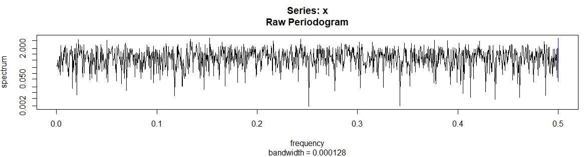
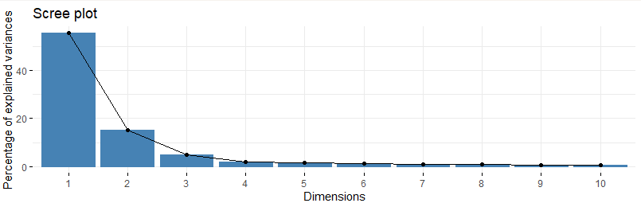
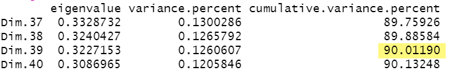
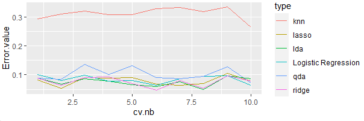
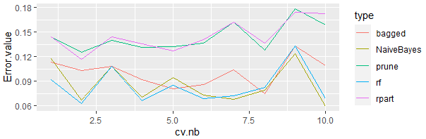
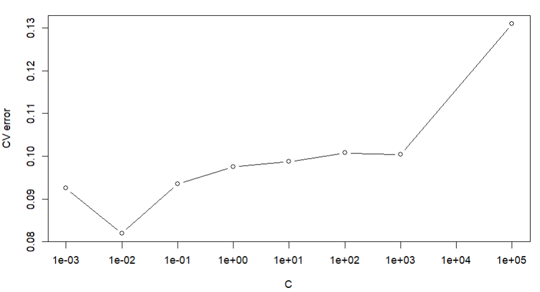
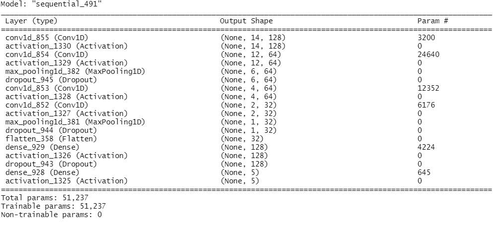
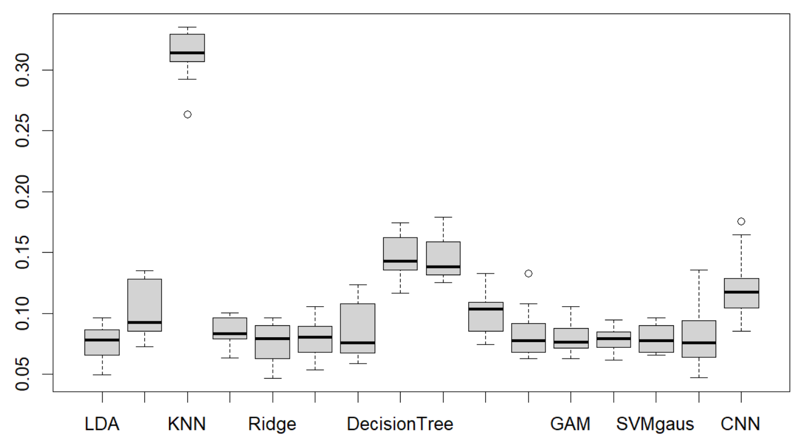

# Introduction
The aim of this second project is to apply the ML methods seen during SY19 courses on three real datasets: `Phoneme`, `Robotics` and `Communities`. 

# Part I - `Phoneme` Dataset
The dataset was extracted from the *TIMIT database (TIMIT Acoustic-Phonetic Continuous Speech Corpus, NTIS, US Dept of Commerce)*. It contains the log-periodograms of 4509 speech frames of 32 ms duration, classified in five phonemes for classification: _"aa", "ao", "dcl", "iy" and "sh"_. From the 4509 samples, we have 2250 for training.

## 1. Data analysis
This part corresponds to the `Phoneme` classification. The dataset contains 2250 observations with 256 predictors and a single response variable. We observe that the classification is in **5 classes** and all the predictors are quantitative.

The spectrum is obtained by taking the discrete Fourier transform of a signal and using the frequency as the horizontal axis and the amplitude as the vertical axis. We use the R command **spectrum** to calculate the **periodogram** and to automatically plot it versus frequency:

```{r, echo=FALSE, out.width="80%", fig.cap="Figure 1: Periodogram of spectrum N.31", fig.align = 'center'}

```

## 2. Data pre-processing

Here we use the **Principal Component Analysis** (PCA) in order to reduce the number of predictors. We reduce the dimensionality of the data by retaining only those features that contain most of the variance and ignoring those that contain almost zero variance.

Realization: With the *prcomp()* and *fviz_eig()* functions from the library *factoextra*, we can plot the percentage of explained variances against the number of dimensions as follow in figure 2:

```{r, echo=FALSE, out.width="45%", fig.cap="Figure 2: PCA explained variance proportion for the first dimensions", fig.align = 'center'}

```

The equation *get_eig()* allows us to see what percentage of the variance is explained by the components used. for example, the *components of the first 39 dimensions explain 90% of the variance* (see figure 3). In the following model selection (Part 3), we select the dimensions of the features according to the type of data that each model is the best at handling.

```{r, echo=FALSE, out.width="40%", fig.cap="Figure 3: PCA explained variance proportion of PC 36 to 40", fig.align = 'center'}

```

## 3. Model training

Instead of a simple split as 1/3 of the data for the test set and 2/3 of the data for the training set, we use **k-fold cross-validation** to get an unbiaised estimation of the performance of the training models. All models below are based on the k-fold cross-validation method. All below plots shows the results for **k=10 folds**.

### 3.1 LDA, QDA, KNN*, Logistic Regression*

The **Logistic regression** and **LDA** methods are closely related, so the results obtained from both should be close.

As a non-parametric method, the **KNN** classifier makes no assumption about the shape of the decision boundary. The number of neighbors k is determined by cross-validation.

Finally, **QDA** is a compromise between the non-parametric **KNN** method and the **LDA** and **Logistic regression** methods. **QDA** obtains a quadratic decision boundary, so it has a wider range of applications than the linear method. Although not as smooth as the KNN method, it is better trained than KNN.

The results are shown in figure 4:

```{r, echo=FALSE, out.width="60%", fig.cap="Figure 4: Results of Discriminant Analysis and Logistic models for the 32 first dimensions of PCA", fig.align = 'center'}

```

We can see that several **linear models fit better**, such as **LDA** and **logistic regressions** (specially **RIDGE optimization**). KNN has the highest error of all, meanwhile the results of the QDA model are between LDA and KNN. The KNN method has high smoothness but low accuracy, probably because of the unbalanced sample size.

### *3.2 Naive Bayes,* *Decision Tree, Ramdom Forest*

Here we compare and analyse the **Naive Bayesian Model** (NBM), **the Decision Tree Model** (DTM), **Bagging** and **Random Forest Models**.

In practice, the NBM model often has good results for a low complexity compared to other classification methods. However, for this dataset it is not the case, as we have trained the model with the first 32 and 64 principal components respectively, and we can see that the **Naive Bayesian** **model** is not always optimal when the number of predictors is high. This is because the plain Bayesian model assumes that the attributes are independent of each other, an assumption that is often not true in practice.

We used the *rpart* package to build the full regression tree, and then optimally prune it. To find an optimal value $\alpha$ (cp), we add an internal cross-validation. We can see that the first splits made by the tree are done in the first principal components, as expected as they represent the linear transformations of the data with highest variances and are good candidates for splitting the data in two.

For 64 principal components, we obtain a decision tree classifier with an error rate of zero. In this case of overfitting, pruning the tree is necessary. We also computed the corresponding confusion matrix and error rate of a bagged decision tree and a random forest.

The training results in 32 dimensions are in figure 5.

```{r, echo=FALSE, out.width="60%", fig.cap="Figure 5: Results of KNN and tree-based methods for the 32 first dimensions of PCA", fig.align = 'center'}

```

The Naive Bayes and Random Forest models have good results but not very stable.

### 3.3 GAM

GAM does not perform well in high-dimensional cases, especially when the sample size is insufficient. We trained a GAM model with smoothing splines with 32, 64 and 128 principal components respectively.

The performances are close, and that the **generalized additive model** with lower dimensional training data is until now the best classifier with minimal prediction error we got.

### 3.4 SVM

We used the training data to build two **SVM classifiers** (both **linear** with *vanilladot* kernel and **non-linear** *rbfdot* kernel) and set **C parameters** using cross-validation (see figure 6).

```{r, echo=FALSE, out.width="30%", fig.cap="Figure 6: Linear SVM CV error for differents C", fig.align = 'center'}

```

From the result we can conclude that the optimal c value is 0.01 for linear SVM and 1 for radial SVM. Then, we calculate the test error using the best value of C in the first 32 principal components as training data.

The SVM models give good MSE results, with the lowest variance.

### 3.5 Neural networks

We use *Tensorflow* and *Keras* libraries to perform the training of **MLP** and **CNN** models.

#### 3.5.1 Multi-Layer Perceptrons

The first step is to create a sequential model from *keras*, a linear stack of multiple layers of neurons. We trained NN with different depth and width to finally define the model with **1 input layer**[64 neurons], **2 hidden layer[\*\*32 and16 neurons] with** dropout\*\* **rate** and **1 output layer**[5].

We use **ReLU activation** expect for the last which is a **sigmoid activation**. And we compiled the defined model with accuracy metric and Adam optimizer. We split the dataset with 70% for training and 30% for validation.

Finally, we evaluate the model with cross-validation on 100 epochs and a batch-size of 128.

The architecture obtained in average 96.43% training accuracy and 92% validation accuracy. Around the 60th epoch, the training accuracy overpass the validation accuracy (which level off to 92% very quickly): this could be a sign of overfitting.

#### 3.5.2 CNN

We also tried the **CNN** model with the architecture in figure 7:

```{r, echo=FALSE, out.width="50%", fig.cap="Figure 7: Architecture of CNN", fig.align = 'center'}

```

The result obtained 93.08% training accuracy and 91.6% verification accuracy.

#### 4. Model selection

## 4. Final model selection

```{r, echo=FALSE, out.width="60%", fig.cap="Figure 8: Boxplot of all CV errors", fig.align = 'center'}

```

On the figure 8 we show a summary of all models, from left to right : LDA, QDA, KNN, Multinomial Logistic Regression, Ridge and Lasso Regression, Naive Bayes, Decision Tree (without and with pruning), Bagging, Random Forest, GAM, linear and gaussian SVM, MLP and CNN.

Comparing the various performances, we finally chose the previous **SVM linear model using 32 principal components** as training parameters.(Need to be test if MLP works better)
