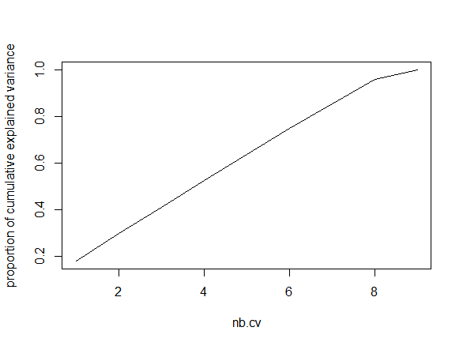
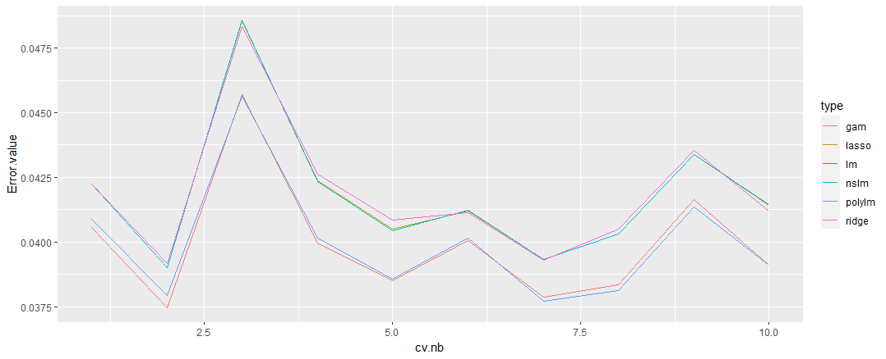
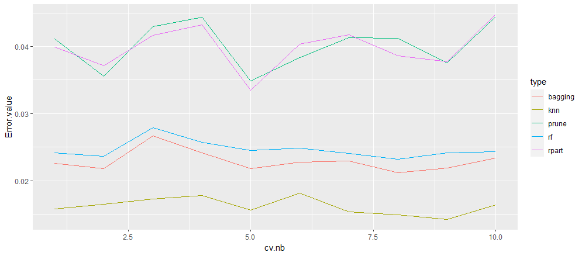
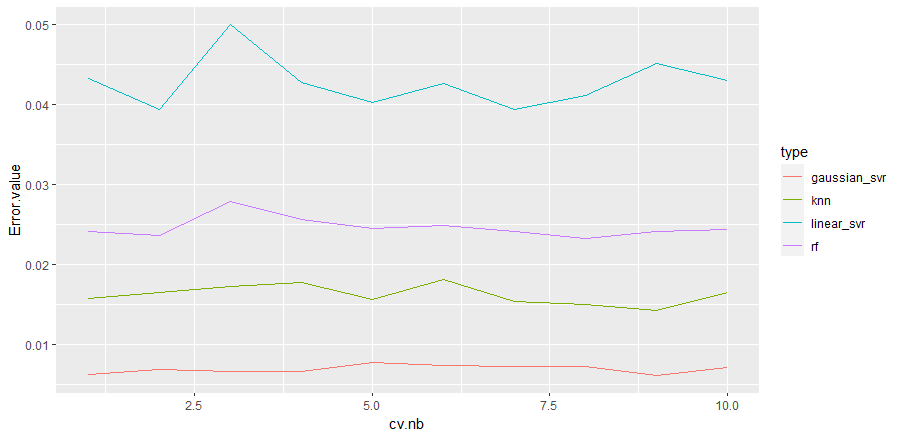
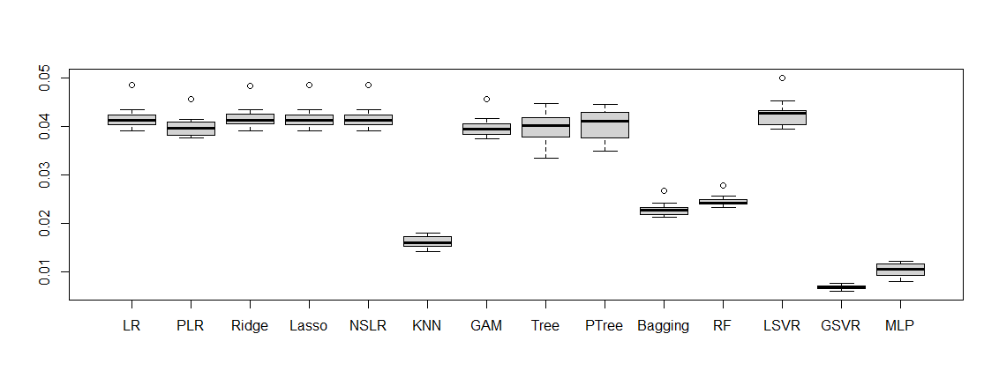

# Dataset Robotics

## 1. Data exploration

This part corresponds to the _Robotics_ dataset and regression model. The dataset contains 4000 observations with 8 predictors and a single quantitative response variable y.

All the predictors are quantitative and already scaled. We plotted the correlation matrix: none of them have a absolute correlation over 0.5. The PCA confirms that results: the plot in figure 1 shows that all descriptors have almost the same explained variance (< 0.20). There is no reason to try to select some of them, considering that we have a large number of training samples.
```{r, echo=FALSE, out.width="50%", fig.cap="PCA cumulative explained variance proportion", fig.align = 'center'}

```

## 3. Models training and comparison

Like for the Phomene dataset, we use **k-fold cross-validation** to get an unbiaised estimation of the performance of the training models. All below plots shows the MSE results for k=10 folds.

### 3.1 Linear, logistic regressions and GAM

As said in previous part, logistic regressions with lasso or ridge are linear models.
The results obtained from both should be close from a simple linear regression.

Analyzing a simple linear model, we obtain R² = 0.4 with all coefficients p-value below e-10. The MSE is not very good but all parameters seems to be important. So we decided to try a more complex model and add transformations to apply to our predictors in the _lm_ function.

We started with a polynomial transformation. Using cross-validation (with the function _poly_), we found out that degree 3 gives the best results with MSE. We also considered basic and natural splines, and obtained the same result: cubic transformation seems to improve the results (see figure 2 below). As we have a low dimensional dataset, GAM can be interesting to study as well. We trained a GAM model with smoothing splines and tuned _df_ using cross-validation: the best MSE is found for df=4, which corresponds to a cubic model as well.

All the results from above mentioned models are shown in figure 2.
```{r, echo=FALSE, out.width="60%", fig.cap="Classification error for Linear and Polynomial models for 10-fold CV", fig.align = 'center'}

```
The cubic models (_polylm, gam, nslm_) give better MSE than linear one but the improvement is not very high: we get an average MSE around 0.04.

### 3.2 KNN, Decision Trees, Bagging and Random Forest

In order to make the model more complex and better fit the data, we now consider non-parametric models.

The KNN regression allows to really good fit the data when choosing the right number of neighbors: a low k can lead to overfitting and a high k to too generalized models. We determined k=9 by cross-validation. The method gave us way better results than before (average MSE around 0.016), but, as said in the previous study, the inference time increases with the size of the training dataset. So we tried other methods with better inference times and better interpretability.

We used the _rpart_ package and the same method as for _phoneme_ to build a full and pruned tree, bagging and random forest. All the results are summarized in figure 3. 
```{r, echo=FALSE, out.width="60%", fig.cap="KNN and tree-based method results for CV", fig.align = 'center'}

```

The pruning doesn't seems to really improve the results. However, the bagging and random forest models gives an average MSE around 0.024, which is above the KNN model but still better than other tree-based methods. Those technics improve prediction accuracy at the expense of
interpretability, but as we do not have much semantic information on the predictors, it is not very important in this case.

### 3.4 SVR
We used the training data to build two SVR (both linear with _vanilladot_ kernel and gaussian _rbfdot_ kernel) and set C parameters using cross-validation.

From the result, we can conclude that the optimal c value is 0.01 for linear SVM and 100 for radial SVM. We get the following results available in figure 4.
```{r, echo=FALSE, out.width="60%", fig.cap="SVM CV errors", fig.align = 'center'}

```

As expected, the linear SVR gives bad results like other linear models.

### 3.5 Neural networks

We use _Tensorflow_ and _Keras_ libraries to train a multi-layer perceptron. For a regression, the last layer must have an output of size 1 to get the estimated value of y.

After testing different depth and width, we choose the following model: 
```{r, eval=FALSE, out.width="40%", fig.cap="SVM CV errors", fig.align = 'center'}
    model <- keras_model_sequential()
    
    # Model architecture
    model %>%
      layer_dense(units = 50, activation = 'relu', input_shape = p) %>%
      layer_dense(units = 10, activation = 'relu') %>%
      layer_dense(units = 50, activation = 'relu') %>%
      layer_dense(units = 1, activation = 'linear')
    
    # Model optimizer
    model %>% compile(
      loss = 'mean_squared_error',
      optimizer = optimizer_rmsprop()
    )
    
    model %>% fit(as.matrix(train[,-(p+1)]), as.matrix(train[,p+1]),
                  epochs=200, batch_size=512, validation_split=0.3)
```

We use ReLU activation except for the last which is a linear activation. As the forward step is really quick, we used a quite big batch in order to have a stable learning. We also tried regularization but we got worse results than with the above simple architecture.

The above code obtained an average MSE of 0.01.

## 4. Final model selection
```{r, echo=FALSE, out.width="80%", fig.cap="Boxplot of all CV errors", fig.align = 'center'}

```
On the above plot, we have from left to right : Linear Regression, Cubic Regression, Ridge and Lasso Regression, Cubic Spline Regression, KNN, Cubic Spline GAM, Decision Tree (without and with pruning), Bagging, Random Forest, linear and gaussian SVM, MLP.

Comparing the various performances, we can clearly see that the better model is a *SVR with a radial kernel and C=100*, with the lowest mean and variance for the MSE. The MLP and the KNN models have also good results on the Robotics dataset. 
